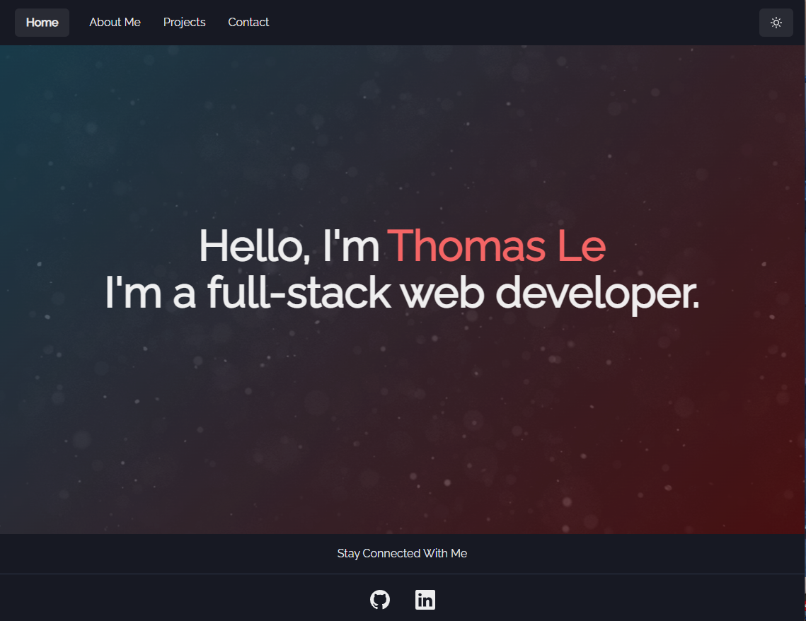

# React Profile

  

  ## Description
    This is my Portfolio made using React, ChackraUI, and animations from Parallax-js
  

## Screenshot

  ## Table of Contents
  - [License](#license)
  - [Questions](#questions)

  ## Questions
  For questions reach out to the following links below: 

  -[Email](mailto:email.email.com)
  -[GitHub](https://www.github.com/Thomasple13)

  ## Link to Server
    https://react-portfolio-seven-kappa.vercel.app/

  ## License
    This project is licensed by [GNU GPLv3](https://choosealicense.com/licenses/gpl-3.0/)
